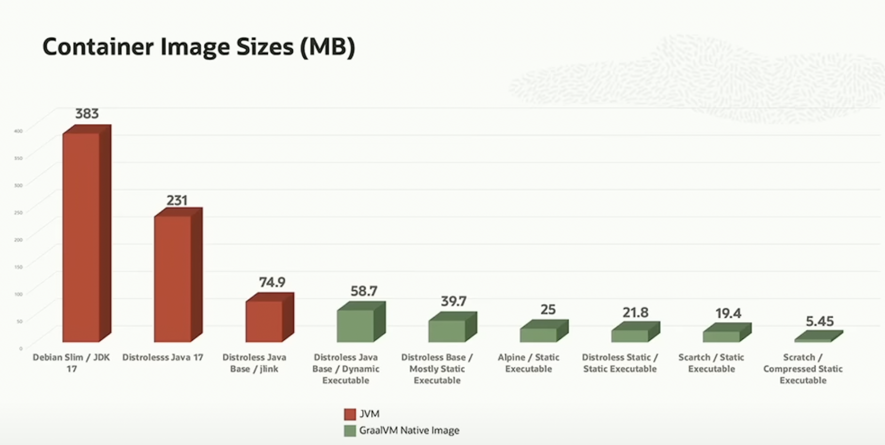
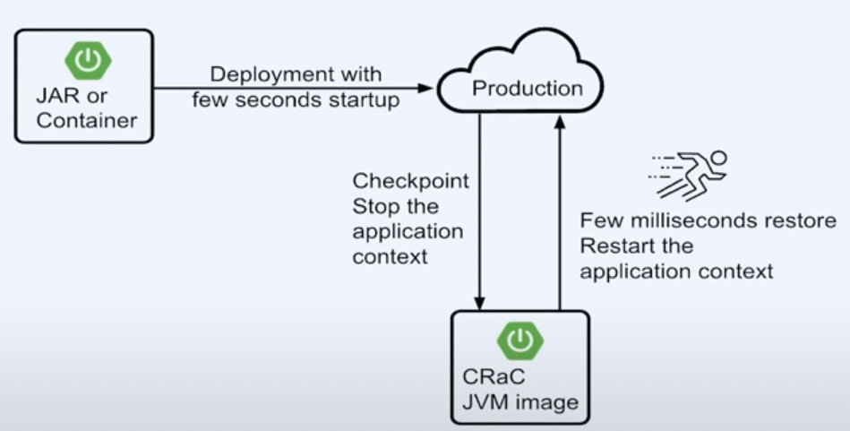
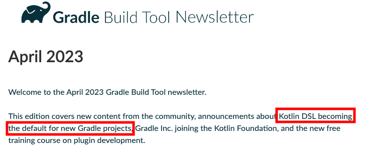

# Spring I/O hangover

## Highlights

- Spring boot 3.1
    - Docker compose
    - Testcontainers integration
- Spring boot 3.2 - November 2023
    - Spring framework 6.1
    - JDK 21 LTS - September 2023 
        - Now Java will have a new lts every 2 years, instead of every 3 years
    - They are working to use Project loom (virtual threads)
    - JVM checkpoint Restore - Project CRaC

## GraalVM

GraalVM and native images:
Seems a middle term adopt, but I feel it's missing a lot of things to ajust or fix. The promises:
- Instant startup
- No warmup
- Low resource usage
- reduced surface attack - No reflection allowed if you don't specify explicitly
- Compact packaging 



The build time is still huge

## Project CRaC
Spring Framework 6.1 and Azul JVM



- https://github.com/CRaC/example-spring-boot
- https://github.com/sdeleuze/spring-boot-crac-demo


## News in Spring boot 3.1
Docker-compose in Spring boot 3.1

Integration with testContainers in Spring boot 3.1, not just for test


## Secure the API

Exists a lot of tools to inspect APIs and explore vulnerabilities. Most relevants advices:

- Disable swagger and api docs in pro environments
```yaml
springdoc:
    api-docs:
        enabled: false
    swagger-ui:
        enabled: false
```
- Or force authentication/authorization for OpenAPI endpoints
- Use UUID instead of id numbers
- `@PreAuthorize`/`@PostAuthorize` to validate Object level access
- Implement rate limits in API Gateway, using for example the `RedisRateLimiter`

Repo -> https://github.com/andifalk/api-security

## Docker compose and test containers
- New dependency to integrate docker compose in dev time
- Better integration of test containers
- New options to run locally

## Spring with Kotlin
Talk about dev experience: 
- Productivity + comfortability + fun
    - "developer experience could be defined as a means for capturing how developers think and feel about their activities within their working environments,
    - with the assumption that an improvement of the developer experience has positive impacts on characteristics such as sustained team and project performance", F. Fagerholm, J. Munch
- Summarizing all the Kotlin good things:
    - data classes
    - Scope functions
    - Extension functions
    - Checked vs Unchecked
    - Try-catch by `runCatching`

Most interesting things:
- Don't use data class for entities -> just for the size of the constructor
- Kotlin will be the default language for new gradle projects: https://newsletter.gradle.org/2023/04



## Multitenant

The best talk considering our scenario.

- Tenants
- Data isolation*
- Observability
- Gateway
- Security

https://speakerdeck.com/thomasvitale/multitenant-mystery-only-rockers-in-the-building
https://github.com/ThomasVitale/spring-boot-multitenancy

## Others
- jMolecules: https://github.com/xmolecules/jmolecules#use-case-expressing-architectural-concepts
- jOOQ: https://www.jooq.org/


### Links
- https://github.com/rwinch/spring-enterprise-authorization-server
- https://github.com/jonatan-ivanov/teahouse
- https://github.com/ThomasVitale/awesome-spring
